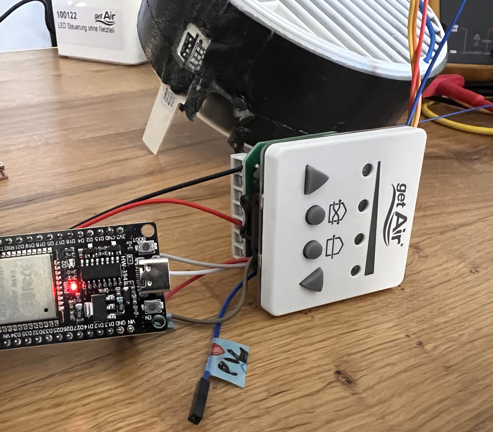
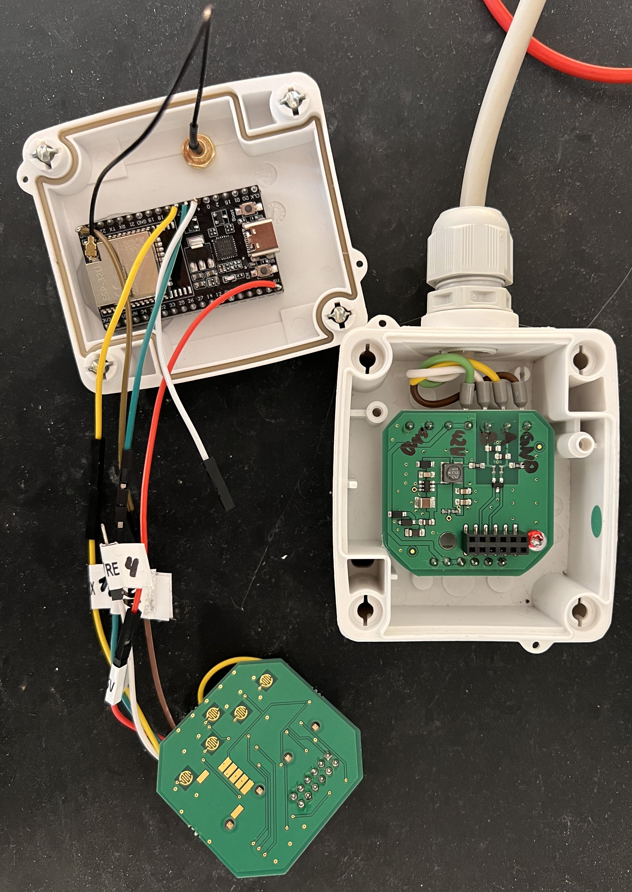
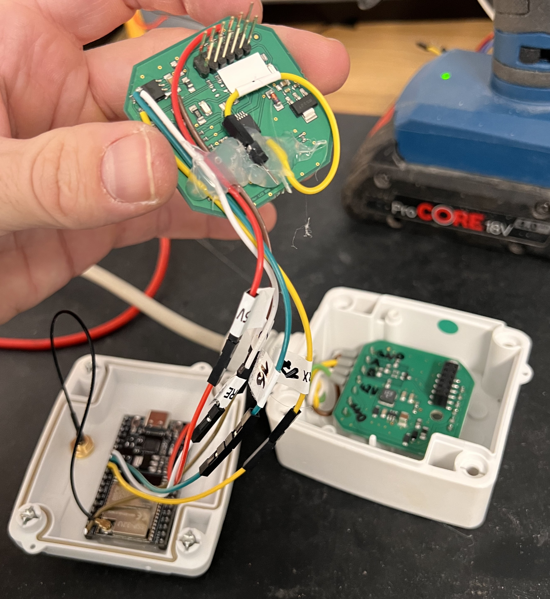
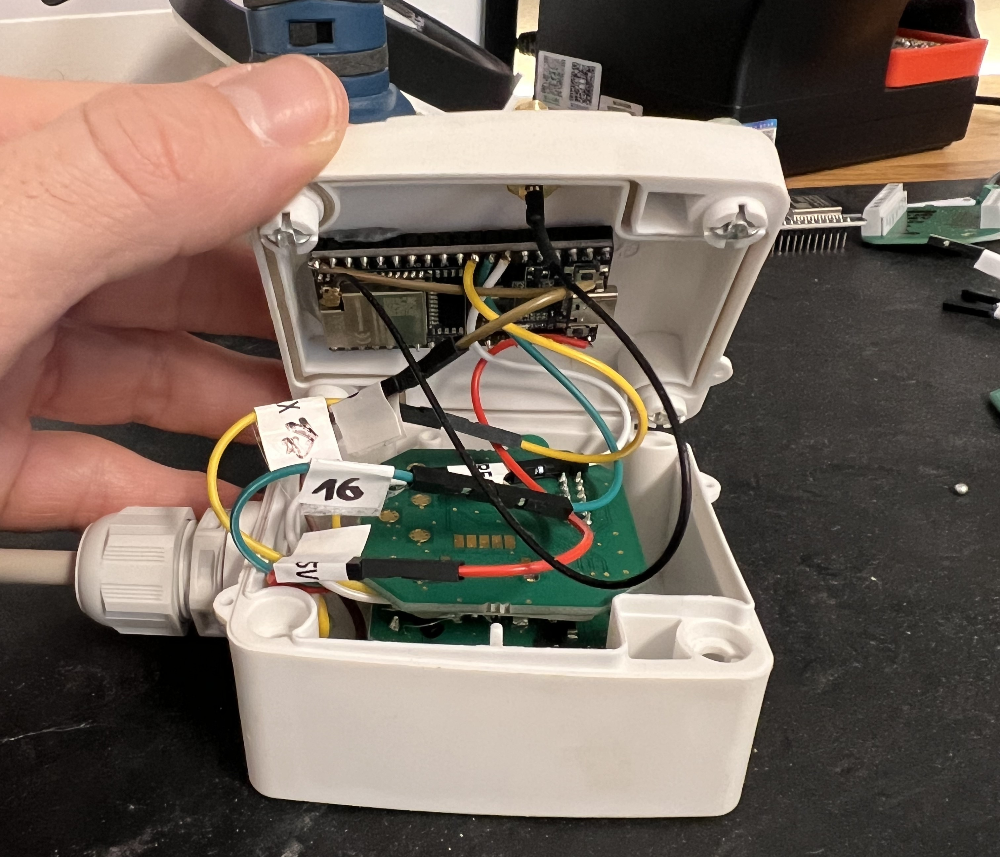

# getAir SmartFan Controller for ESP32

Reverse-engineered ESP32 replacement controller for the getAir SmartFan decentralized ventilation system and the rebranded Viessmann Vitovent 100-D.

The ESP32 takes over the original controller role on the RS485 bus and exposes all fans, temperatures and humidity values via MQTT for Home Assistant.

> Current status: working prototype tested on real hardware.
>
> The current firmware is intentionally kept close to the tested implementation and has not yet been refactored.

---

## Features

- Reverse-engineered RS485 protocol
- Works with up to 6 fan nodes (`0x00`–`0x05`)
- ESP32 acts as custom RS485 master
- MQTT integration with Home Assistant auto-discovery
- Supports:
  - fan speed
  - airflow direction
  - online detection
  - temperature and humidity sensors
- Compatible with:
  - getAir SmartFan
  - Viessmann Vitovent 100-D

---

## Example Setup

### Original LED Control Unit with ESP32 Prototype



### Modified LED Control Unit

The original getAir LED Control Unit is reused instead of adding a separate RS485 module.

The following modifications were made:

- 5 V supply tapped from the original controller PCB
- Existing onboard RS485 transceiver reused
- PIC TX connection to the transceiver disconnected
- `DE` and `/RE` pins lifted and connected to the ESP32
- ESP32 installed in a separate enclosure


### Wiring Overview



### RS485 Transceiver Modification

The original PIC microcontroller was disconnected from the RS485 transceiver by lifting its TX pin. The transceiver direction pins `DE` and `/RE` were then connected to the ESP32.



### Final Assembly



### Installed Gateway


---

## Hardware

Required:

- ESP32 development board
- Original getAir LED Control Unit or external RS485 transceiver
- Access to the SmartFan RS485 bus
- Optional: MQTT broker + Home Assistant

Typical ESP32 wiring to the reused transceiver:

| ESP32 GPIO | Function |
|---|---|
| GPIO17 | RS485 `DI` |
| GPIO16 | RS485 `RO` |
| GPIO4 | `DE` + `/RE` |
| 5V | Controller 5V supply |
| GND | Common ground |

UART configuration:

```text
2400 baud, 8N1
```

---

## Repository Structure

```text
.
├── README.md
├── src/
│   └── main.cpp
├── docs/
│   ├── protocol.md
│   └── images/
├── tools/
│   └── Frame-Builder_inclChecksum.xlsx
└── LICENSE
```

---

## Firmware

The current firmware is located in:

```text
src/main.cpp
```

The code is still monolithic because this exact version was tested successfully on real hardware.

Planned future refactoring:

- `protocol.cpp`
- `mqtt.cpp`
- configuration file
- PlatformIO project structure

Before compiling, replace the credentials at the top of `main.cpp`:

```cpp
WIFI_SSID
WIFI_PASSWORD
MQTT_HOST
MQTT_USER
MQTT_PASSWORD
```

Typical Arduino libraries used:

- `WiFi.h`
- `PubSubClient.h`
- `HardwareSerial.h`

---

## Home Assistant Integration

The ESP32 publishes Home Assistant MQTT discovery entities automatically.

For each detected fan node, the following entities are created:

- Fan speed
- Direction
- Online state
- Humidity
- Temperature
- Sensor availability

Typical MQTT topic structure:

```text
smartfan/<gateway-id>/node0/speed/set
smartfan/<gateway-id>/node0/speed/state
smartfan/<gateway-id>/node0/temperature/state
```

---

## Protocol Documentation

Detailed reverse-engineering information is available in:

```text
docs/protocol.md
```

Including:

- RS485 frame formats
- Checksum calculation
- Node discovery
- Sensor polling
- Observed timing behavior

---

## Known Limitations

- No native command acknowledgement exists
- Continuous command transmission is required
- Current code has only been tested on one hardware setup

---

## Planned Improvements

- Wiring diagram and schematic

---

## Contributing

Additional captures, hardware revisions and pull requests are welcome.

If you discover additional frame types or confirm currently inferred behavior, please open an issue.

---

## License

MIT

